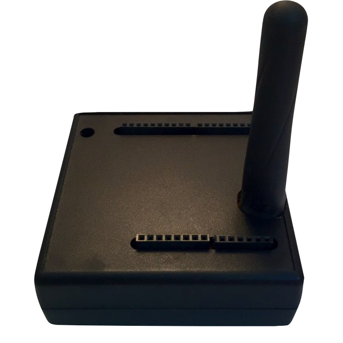
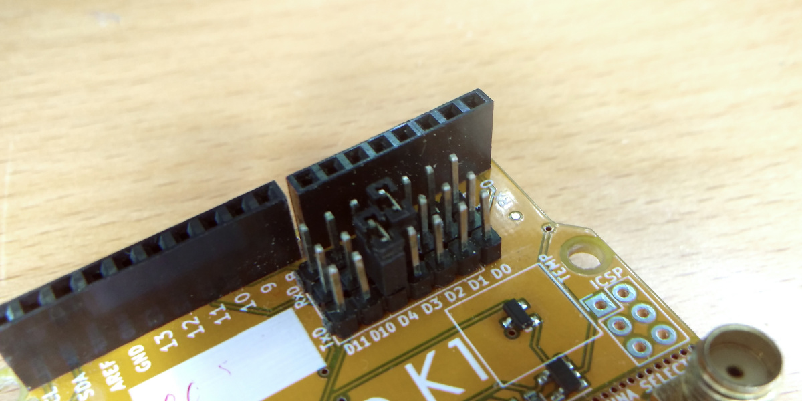

The AllWize G1 is a bundle of an AllWize K1 shield on top of an ESP8266-based board, everything inside a nice indoor case with casted holes for power, GPIOs and the antenna. The board can then be used as Single Channel Gateway and forward the incoming messages to an MQTT broker, a LoRaWAN network server or any other service you want to use.

You can buy an AllWize G1 from our shop or you can buy just the AllWize K1 and stack it on a Wemos D1 (or equivalent) board. The only hardware configuration you will have to do is to set the RX/TX jumpers to the proper positions. This is necessary because the ESP8266 has only one hardware serial (OK, one and a half) and it's used by the USB connector, so we have to use two general IO pins as SoftwareSerial ports.

Check the image below to see the configuration the examples in the library are configure to use.

## Code examples

|MQTT Bridge|LoRaWAN Bridge|
|---|---|
|||
|Turn your AllWize G1 into a Wize to MQTT bridge an send your sensor data to any MQTT broker out there|Use the Semtech Legacy Protocol to connect your AllWize G1 to a LoRaWAN Network Server (like [The Things Stack](https://www.thethingsnetwork.org/) or [ChirpStack](https://www.chirpstack.io/))
|
