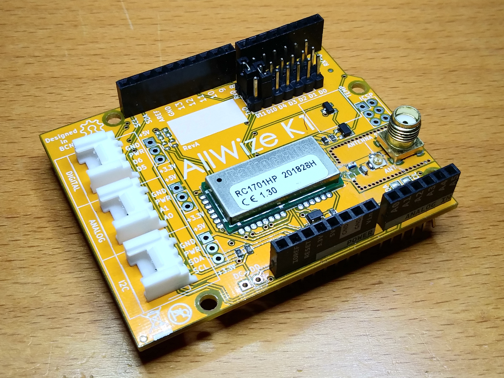
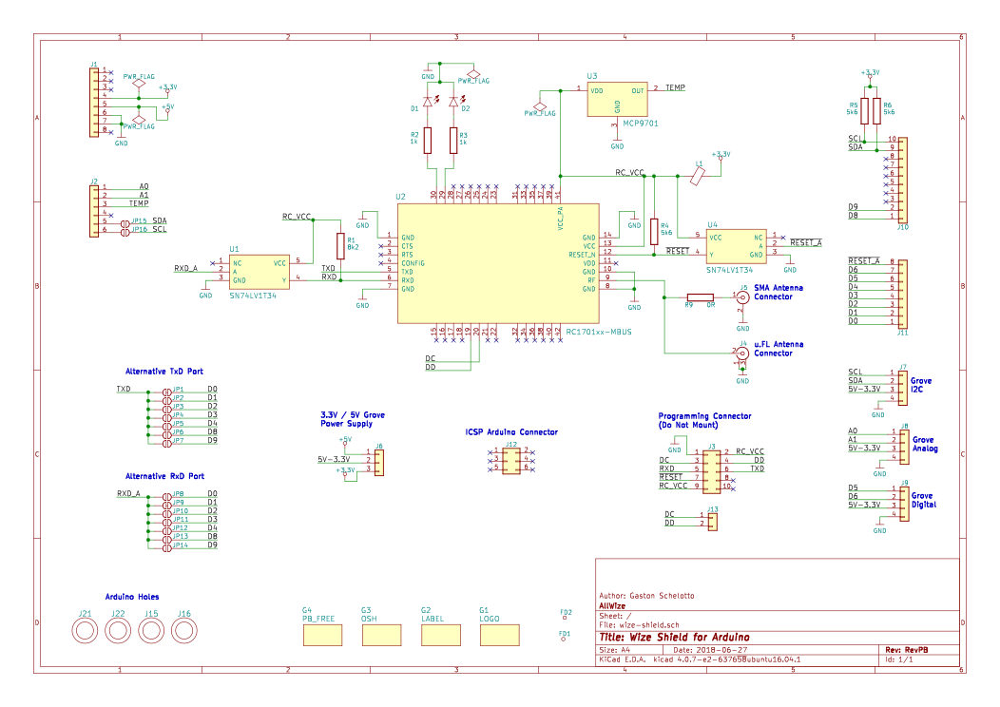

The Allwize K1 Shield is an Arduino-compatible shield based on the RadioCrafts RC1701HP module.

## Reference links

* [AllWize K1 product page](https://www.allwize.io/product-page/the-allwize-k1)
* [AllWize K1 Github repository](https://github.com/AllWize/AllWizeK1-hardware)
* [AllWize K1 Schematic (PDF)](https://github.com/AllWize/AllWizeK1-hardware/raw/master/RevPB/AllWize%20K1%20-%20RevPB.pdf)

## Schematic

## Features

* **Arduino UNO R3 form factor**
* **RadioCrafts RC1701HP-XXX** radio module supporting Wize protocol
* **MCP9701** analog temperature sensor
* **3x Grove connectors** for digital, analog and I2C sensors (compatible with 3V3 or 5V sensors)
* **SMA antenna connector** with the option to add an iPEX connector for an external antenna
* Flexible PIN configuration for UART communcations from the host board to the radio module

## Description

The radio module in the Allwize K1 Shield is a RadioCrafts RC1701HP-XXX. The module version available at the usual suppliers comes flashed with a Wireless-MBUS4 compatible firmware. Whilst the one in the Allwize K1 Shield sports a revisited version that aims to fully support the Wize protocol. The module is powered with 3V3 and has a UART port, a couple of GPIOs to drive status LEDs, a RESET and a CONFIG pins.

The Allwize K1 Shield RevPB is meant to be compatible with a range of boards with the Arduino UNO form factor. But each host board has its own capabilities. In particular, the option to have more than one hardware serial port is key to be able to both communicate to the radio module and have serial output available (for debugging, data transfer,...).

This is why we have added serial selector jumpers to the board so the user can select what GPIOs will be connected to the radio RX/TX lines. The shield will be delivered with the jumpers connected to pins 0 & 1 (usually first hardware serial port on most boards). If you need to connect the radio module to other pins (2,3,4,10 or 11) you will have to use a user-defined USRAT (SAMD boards) or SoftwareSerial library (for Arduino UNO). Check the serial port selection section below for more info.

Of course, the board has an Arduino header. See the table at the connections section for a full list of used pins.

We have added 3 Grove (TM) connectors to the board to use them with the plethora of Grove sensors and actuators available. These connectors are specialized (from left to right in the image below): I2C, Analog & Digital. See the table at the [connections](#connections) section for a full list of used pins. To be able to use the I2C grove connector with an Arduino UNO board you have to add two 0Ohm resistors (or a solder jumper) to pads labelled SDA and SCL near the A4 and A5 GPIOs. The grove connectors can be powered either with 5V or 3V3. Each connector has it's own power selector jumper. 

The Allwize K1 Shield RevPB also has an onboard MCP9701 temperature sensor, so you can start reporting environment data right from the start.

The antenna connector in the Allwize K1 Shield is an SMA connector. There are few 90 degrees 169MHz antennas available in the market (we have just spotted 1 model) so it is meant to place a straight antenna on top of the shield. This means the shield must be a "top shield". You can also use a iPEX connector for an external antenna. To do so you will have to remove the 0Ohm resistor closer to the SMA connector and solder an iPEX connector in place, using the now free pad closer to the radio module as the signal pad of the iPEX connector.

## Connections

|Component|Arduino pins|Notes|
|---|---|---|
|Radio module RX|0 (default for RX), 1, 2, 3, 4, 10 and 11|
|Radio module TX|0, 1 (default for TX), 2, 3, 4, 10 and 11|
|Radio module RESET|7|
|Radio module DC| |Specific header DC-DD
|Radio module DD| |Specific header DC-DD
|Radio module RF| |50Z to SMA
|Temperature sensor|A2|MCP9701
|Grove I2C|SDA / SCL or A4 / A5 (with 0 Ohm pads)|On board pull-ups
|Grove Digital|5 / 6| |
|Grove Analog|A0 / A1| |

## Supported boards

|Board|Platform|Debug|Radio|Notes|
|---|---|---|---|---|
|Arduino Uno|AVR|Serial|SoftwareSerial|A4 and A5 jumpers needed for I2C|
|Arduino Leonardo|AVR|Serial|HardwareSerial (Serial1)||
|Arduino Zero|SAMD|SerialUSB|HardwareSerial (Serial1)||
|Arduino MKRZero|SAMD|SerialUSB|HardwareSerial (Serial1)||
|Arduino M0|SAMD|SerialUSB|HardwareSerial (Serial1)||
|Arduino M0 Pro|SAMD|SerialUSB|HardwareSerial (Serial1)|See note below|
|Wemos D1 and others|ESP8266|Serial|SoftwareSerial||
|ESP32-based|ESP32|Serial|HardwareSerial||

**Arduino M0 Pro**: Use the Native USB port to flash this board. If a "port is busy" message shows up in a Linux host try uninstalling the Modem Manager daemon (`apt purge modemamanger`)